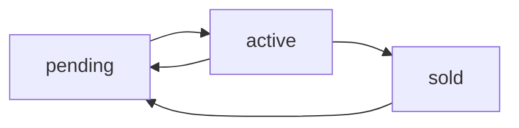

## Overview

The plot endpoints provide read access to land plot data including base prices, current bids, ownership status, policy adjustments, and plot metadata. This is the primary data source for map visualization and auction tracking.

## Get all plots

### GET /api/data/plots

Retrieve all plots with their current auction status and pricing.

```bash
curl http://localhost:8000/api/data/plots
```

**Query parameters:**

<ParamField query="t" type="number">
  Cache-busting timestamp to prevent stale data
  
  Example: `t=1709123456789`
</ParamField>

**Response:**

<ResponseField name="plots" type="array">
  Array of plot objects sorted by plot number
  
  <Expandable title="Plot object structure">
    <ResponseField name="number" type="number">
      Unique plot identifier (1-24)
    </ResponseField>
    
    <ResponseField name="base_price" type="number">
      Initial plot price before any adjustments (in ₹)
    </ResponseField>
    
    <ResponseField name="total_plot_price" type="number">
      Current plot price including base price (in ₹)
    </ResponseField>
    
    <ResponseField name="round_adjustment" type="number">
      Price adjustment from policy rounds (in ₹). Can be positive or negative.
    </ResponseField>
    
    <ResponseField name="current_bid" type="number">
      Highest bid amount for this plot (in ₹). `null` if no bids.
    </ResponseField>
    
    <ResponseField name="winner_team_id" type="string">
      ID of the team with the highest bid. `null` if no bids.
    </ResponseField>
    
    <ResponseField name="status" type="string">
      Plot auction status:
      - `"pending"`: Not yet auctioned
      - `"active"`: Currently being auctioned
      - `"sold"`: Auction complete, has winning bidder
    </ResponseField>
    
    <ResponseField name="plot_type" type="string">
      Plot classification (Round 4 only):
      - `"Residential"`
      - `"Commercial"`
      - `"Industrial"`
      - `"Mixed-Use"`
    </ResponseField>
    
    <ResponseField name="infrastructure" type="object">
      Infrastructure attributes affecting plot value
      
      <Expandable title="Infrastructure details">
        <ResponseField name="road_access" type="boolean">
          Whether plot has direct road access
        </ResponseField>
        
        <ResponseField name="water_supply" type="boolean">
          Whether plot has municipal water connection
        </ResponseField>
        
        <ResponseField name="electricity" type="boolean">
          Whether plot has power grid connection
        </ResponseField>
      </Expandable>
    </ResponseField>
  </Expandable>
</ResponseField>

**Example response:**

```json
[
  {
    "number": 1,
    "base_price": 1000000,
    "total_plot_price": 1000000,
    "round_adjustment": 0,
    "current_bid": 1250000,
    "winner_team_id": "team-1",
    "status": "sold",
    "plot_type": "Residential",
    "infrastructure": {
      "road_access": true,
      "water_supply": true,
      "electricity": true
    }
  },
  {
    "number": 2,
    "base_price": 850000,
    "total_plot_price": 850000,
    "round_adjustment": 0,
    "current_bid": null,
    "winner_team_id": null,
    "status": "pending",
    "plot_type": "Commercial",
    "infrastructure": {
      "road_access": true,
      "water_supply": false,
      "electricity": true
    }
  }
]
```

**Usage example:**

```tsx app/live/page.tsx
const plotsRes = await fetch(`/api/data/plots?t=${Date.now()}`, {
  cache: "no-store"
});
const plots = await plotsRes.json();
```

---

## Plot price calculation

The effective plot price is calculated differently depending on the auction state:

**During bidding (Rounds 1 & 4):**
```javascript
const effectivePrice = plot.current_bid || plot.total_plot_price;
```

**After policy adjustments (Rounds 2, 3, 5, 6):**
```javascript
const effectivePrice = (plot.current_bid || plot.total_plot_price) + 
                       plot.round_adjustment;
```

**For team portfolio calculation:**
```javascript
const portfolioValue = plots
  .filter(p => p.winner_team_id === teamId && p.status === "sold")
  .reduce((sum, p) => {
    const price = Number(p.current_bid || p.total_plot_price || 0);
    const adjustment = Number(p.round_adjustment || 0);
    return sum + price + adjustment;
  }, 0);
```

---

## Filtering plots

**Get plots owned by a team:**
```javascript
const teamPlots = plots.filter(p => 
  p.winner_team_id === teamId && p.status === "sold"
);
```

**Get active plot:**
```javascript
const activePlot = plots.find(p => p.status === "active");
```

**Get pending plots:**
```javascript
const pendingPlots = plots.filter(p => p.status === "pending");
```

**Get plots by type (Round 4):**
```javascript
const residentialPlots = plots.filter(p => 
  p.plot_type === "Residential"
);
```

---

## Real-time updates

Plot data is updated in real-time via Socket.IO. Subscribe to these events:

**plot_update event:**
```tsx app/dashboard/page.tsx
socket.on("plot_update", (data) => {
  // data contains: { number, status, current_bid, winner_team_id, ... }
  setPlots(prev => prev.map(p => 
    p.number === data.number ? { ...p, ...data } : p
  ));
});
```

**plot_adjustment event:**
```tsx
socket.on("plot_adjustment", (data) => {
  // data contains: { plot_number, plot: { round_adjustment, ... } }
  setPlots(prev => prev.map(p => 
    p.number === data.plot_number ? { ...p, ...data.plot } : p
  ));
});
```

**auction_state_update event:**
```tsx
socket.on("auction_state_update", (data) => {
  if (data.current_plot_number) {
    setPlots(prev => prev.map(p => {
      if (p.number === data.current_plot_number) {
        return { ...p, status: "active" };
      }
      if (p.status === "active") {
        return { ...p, status: data.status === "reversed" ? "pending" : "sold" };
      }
      return p;
    }));
  }
});
```

See [Socket.IO events](/api/socket-events) for complete documentation.

---

## Plot status transitions

Plots move through these states during the auction:



| Transition | Trigger | Description |
|------------|---------|-------------|
| pending → active | Admin clicks **Next** | Plot enters auction |
| active → sold | Admin clicks **Sell** | Plot awarded to winner |
| active → pending | Admin clicks **Prev** | Auction reversal |
| sold → pending | Admin clicks **Prev** | Undo sale |

---

## Error responses

<ResponseField name="error" type="object">
  <Expandable title="Error structure">
    <ResponseField name="detail" type="string">
      Human-readable error message
    </ResponseField>
    
    <ResponseField name="status_code" type="number">
      HTTP status code
    </ResponseField>
  </Expandable>
</ResponseField>

**Common errors:**

| Status | Error | Description |
|--------|-------|-------------|
| 500 | Internal server error | Database connection or server issue |

**Example error:**

```json
{
  "detail": "Failed to retrieve plot data",
  "status_code": 500
}
```
