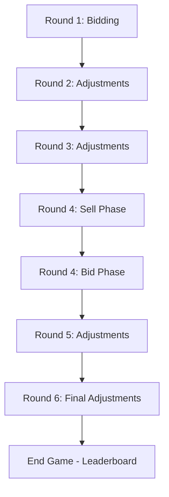

AuctionFest uses a unique 6-round auction system that alternates between bidding rounds and policy adjustment rounds. This structure simulates real-world scenarios where property values fluctuate based on government policies and market conditions.

## Round structure

The auction consists of 6 rounds split into two types:

<CardGroup cols={2}>
  <Card title="Bidding rounds" icon="gavel">
    Round 1 and Round 4 — Teams actively bid on plots
  </Card>
  <Card title="Adjustment rounds" icon="chart-line">
    Round 2, 3, 5, 6 — Admin applies policy-based adjustments
  </Card>
</CardGroup>

### Round 1: Initial bidding

**Objective:** Acquire plots at base prices through competitive bidding

- All plots start at their calculated base price (area × rate)
- Teams bid on plots one at a time in sequence
- Minimum bid increment: ₹1 lakh above current bid
- No adjustments applied yet
- Standard English auction rules apply

**Flow:**
1. Admin starts the auction and advances to first plot
2. Plot appears on all team dashboards
3. Teams place bids using the bid interface
4. Admin clicks "SELL" to start 3-second countdown
5. Plot is sold to highest bidder
6. Admin advances to next plot

<Info>
  Teams cannot bid consecutively on the same plot. After placing a bid, they must wait for another team to outbid them.
</Info>

### Round 2 & 3: First adjustment phases

**Objective:** Simulate policy impacts on property values

- No bidding occurs during these rounds
- Admin pushes policy questions to all teams
- Admin applies percentage-based adjustments to plot values
- Adjustments can be positive (value increase) or negative (value decrease)
- Teams view the map with color-coded adjustments

**Policy examples:**
- "A new metro line is announced near the northern district" → +20% to plots in that area
- "Flooding risk increases in low-lying areas" → -15% to affected plots
- "Tech park construction begins in the east" → +25% to nearby commercial plots

<Note>
  Adjustments are cumulative and affect the starting price for future bidding rounds.
</Note>

### Round 4: Final bidding with marketplace

Round 4 is the most complex, featuring a two-phase structure:

<Tabs>
  <Tab title="Phase 1: Sell phase">
    **Teams can sell their owned plots:**
    
    - List plots for 100-110% of current value
    - Cannot bid during this phase
    - Can unsell plots before phase ends
    - Other teams cannot buy directly — plots go to auction
    
    **Dashboard changes:**
    - Shows "My Portfolio" instead of bid interface
    - Input field for asking price
    - Active listings show "Waiting for buyer" status
    - UNSELL button to remove listing
  </Tab>
  <Tab title="Phase 2: Bid phase">
    **Unsold listed plots go to auction:**
    
    - Only plots that were listed but not sold appear
    - Standard bidding rules apply
    - Original seller CANNOT bid on their own plot
    - Starting price = asking price set by seller
    
    **Special rules:**
    - Plot ownership transfers on sell
    - New owner pays asking price from cash
    - Original seller receives asking price
    - Budget adjustments happen instantly
  </Tab>
</Tabs>

**Admin controls:**
- "START SELL PHASE" button activates marketplace
- "END SELL → START BIDDING" closes marketplace and creates bid queue
- Admin uses NEXT/SELL to auction unsold listings

<Warning>
  Teams cannot bid on plots they are selling. This prevents artificial price inflation.
</Warning>

### Round 5 & 6: Final adjustments

**Objective:** Apply final policy impacts before scoring

- Same mechanics as Round 2 & 3
- Admin can introduce "surprise" policies
- These adjustments directly affect final scores
- Teams cannot change their portfolio after Round 4

**Round 6 special feature:**
- After adjustments, admin clicks "END GAME"
- Final leaderboard appears for all teams
- Scores calculated with ₹10 lakh bonus per plot

## Bidding rules

### Valid bids

A bid is accepted if:

1. **Amount is sufficient:** At least ₹1 lakh above current bid
2. **Team has budget:** Bid amount ≤ remaining cash
3. **Not consecutive:** Team doesn't already hold the highest bid
4. **Round is active:** Auction status is "running" (not "selling" or "paused")
5. **Bidding round:** Round 1 or Round 4 (not adjustment rounds)
6. **Not seller:** Team doesn't own the plot being auctioned (Round 4)

### Invalid bids

Common rejection reasons:

<Accordion title="You already hold the highest bid">
  Teams cannot bid twice in a row on the same plot. Wait for another team to outbid you before bidding again.
</Accordion>

<Accordion title="Bid exceeds remaining budget">
  Your bid amount is higher than your available cash. Check your budget in the header and reduce your bid.
</Accordion>

<Accordion title="Minimum bid amount is ₹X">
  Your bid is too low. Minimum bid is current bid + ₹1 lakh, or the starting price if no bids exist.
</Accordion>

<Accordion title="Bidding not allowed during adjustment rounds">
  You tried to bid during Round 2, 3, 5, or 6. Wait for the next bidding round (Round 4 or after adjustments).
</Accordion>

<Accordion title="You cannot bid on a plot you are selling">
  During Round 4, you listed this plot for sale. Original sellers cannot rebid on their own plots.
</Accordion>

### Bid increments

**Minimum increment:** ₹1 lakh (100,000)

**Recommended strategy increments:**
- Early plots: ₹5 lakh jumps (fast bidding)
- Mid-auction: ₹2-3 lakh jumps (strategic)
- Final plots: ₹1 lakh jumps (budget optimization)

<Info>
  The dashboard's +/- buttons use ₹5 lakh (500,000) increments by default for faster bidding.
</Info>

## Selling mechanism

### The "SELL" countdown

When the admin clicks **SELL**:

1. **3-second countdown begins**
   - Large red overlay appears
   - Teams can still place last-second bids
   - Current highest bidder displayed

2. **Plot is sold**
   - Ownership transfers to highest bidder
   - Budget deducted from winning team
   - Plot marked as "sold" on map
   - WebSocket broadcasts to all clients

3. **Summary display**
   - Teams see "SOLD!" animation with winner name and price
   - Displays for 3 seconds
   - Admin advances to next plot

<Warning>
  If no bids are placed when SELL is clicked, the plot is marked "unsold" and returned to pending status.
</Warning>

## Adjustment mechanics

### How adjustments work

**Admin inputs:**
- Plot number(s): Single plot or comma-separated list (e.g., "1,2,5,8")
- Adjustment percentage: Positive or negative (e.g., +20 or -15)

**Calculation:**
```
New Adjustment = Current Plot Value × (Percentage / 100)
Total Plot Value = Base Value + All Adjustments
```

**Example:**
- Plot base price: ₹50 lakh
- Round 2: +20% → Adjustment = +₹10 lakh → Total = ₹60 lakh
- Round 3: -10% → Adjustment = -₹6 lakh → Total = ₹54 lakh
- Round 5: +15% → Adjustment = +₹8.1 lakh → Total = ₹62.1 lakh

<Note>
  Adjustments are stored separately and displayed on plot cards. The base price never changes.
</Note>

### Cumulative adjustments

Adjustments stack across rounds:

- Each round's adjustment is calculated on the **current total value** (not base)
- Both positive and negative adjustments can apply to the same plot
- Final value determines starting bid for Round 4
- Team portfolios reflect all adjustments in net worth calculations

### Undo functionality

Admin can undo the last adjustment:

- Reverts the most recent adjustment transaction
- Restores previous plot values
- Only undoes one transaction at a time
- Cannot undo across rounds

## Round 4 marketplace details

### Selling process

**Step 1: Team lists plot**
1. Team opens "My Portfolio" during sell phase
2. Enters asking price (100-110% of current value)
3. Clicks SELL
4. Plot appears in marketplace for all teams

**Step 2: Admin closes sell phase**
1. Admin reviews all listings in admin panel
2. Clicks "END SELL → START BIDDING"
3. System creates queue of unsold plots
4. Sell phase ends, bid phase begins

**Step 3: Unsold plots auction**
1. Admin advances through plot queue using NEXT
2. Teams bid normally (except original seller)
3. Winner pays asking price as starting point
4. Plots sold to new owners

<Accordion title="What happens if no one bids?">
  If a listed plot receives no bids during the bid phase, it remains with the original owner at the updated value. The owner keeps the plot and no transaction occurs.
</Accordion>

### Pricing constraints

**Minimum:** 100% of current value (base + adjustments)

**Maximum:** 110% of current value

**Why the 10% range?**
- Prevents extreme overpricing
- Encourages realistic market behavior
- Balances risk vs. reward for sellers

**Example:**
- Plot current value: ₹60 lakh
- Valid asking prices: ₹60-66 lakh
- Invalid: ₹70 lakh (too high) or ₹55 lakh (too low)

## Auction flow diagram



## Scoring system

Final score calculation:

```
Final Score = Net Worth + (Plots Won × ₹10,00,000)

Where:
Net Worth = Remaining Cash + Total Plot Values
Total Plot Values = Sum of (Current Bid + Adjustments) for all owned plots
```

**Plot bonus rationale:**
- Rewards plot acquisition strategy
- Prevents pure cash-hoarding
- Encourages active participation
- Balances quality vs. quantity

<Info>
  A team with fewer expensive plots can outscore a team with many cheap plots if their net worth is higher.
</Info>

## Strategy tips

**Round 1:**
- Avoid overpaying early — save budget for later
- Identify high-value areas from the map
- Let others bid first to gauge competition

**Round 2-3:**
- Watch for policy hints about plot locations
- Track which plots get positive adjustments
- Plan which plots to target in Round 4

**Round 4 Sell:**
- Consider selling plots that received negative adjustments
- Price aggressively (near 110%) if plot is desirable
- Keep high-value plots if adjustments are complete

**Round 4 Bid:**
- Target undervalued plots from sellers
- Avoid bidding wars — stick to budget limits
- Remember: Original sellers can't bid against you

**Round 5-6:**
- No actions available — watch adjustments
- Calculate projected final scores
- Hope your portfolio benefits from policies